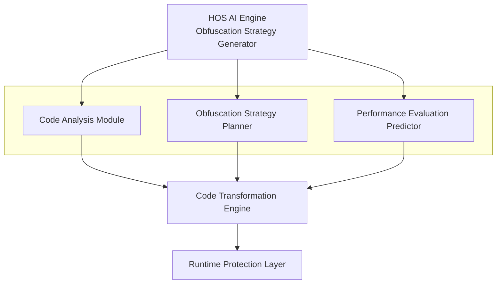

# HOS - AI-Driven Code Encryption System


HOS (Honestly Of Selfish) is an AI-driven personalized code encryption system designed to "selfishly" protect developers' code.

## Core Features

- **AI-Dynamic Obfuscation Strategy**: Each user has unique "genes"
- **Intelligent Performance and Security Balance**: Automatically adjusts obfuscation strength
- **Powerful Runtime Protection**: Prevents debugging and memory tampering
- **Multi-language Support**: Initial version supports Python, with future extensions to C/C++, Rust, Go, etc.
- **Modular Design**: Easy to extend and customize

## System Architecture



## Quick Start

### Installation

```bash
# Using Poetry
poetry install

# Or using pip
pip install .
```

### Basic Usage

```bash
# Encrypt Python file
hos protect --input example.py --output protected_example.py

# Encrypt entire directory
hos protect --input src/ --output protected_src/

# Custom obfuscation strength
hos protect --input example.py --output protected_example.py --level high
```

## Directory Structure

```
hos/
├── analyzer/        # Code analysis module
├── ai/              # AI obfuscation strategy generation
├── transformer/     # Code transformation engine
├── runtime/         # Runtime protection layer
├── performance/     # Performance evaluation predictor
├── cli/             # Command line tools
└── utils/           # Utility functions
tests/               # Test files
docs/                # Documentation
examples/            # Example code
```

## Technology Stack

- **Core Language**: Python 3.8+
- **Code Analysis**: Tree-sitter
- **AI Model**: Fine-tuned model based on Code LLM
- **Build Tool**: Poetry
- **Testing Framework**: pytest

## Development Guide

### Running Tests

```bash
poetry run pytest
```

### Code Style Checking

```bash
poetry run black hos/ tests/
poetry run isort hos/ tests/
poetry run flake8 hos/ tests/
```

## Roadmap

- **v1.0**: Python code protection, basic obfuscation features
- **v2.0**: C/C++ support, based on LLVM IR-level obfuscation
- **v3.0**: Rust/Go support
- **v4.0**: Android NDK/ARM support
- **v5.0**: WASM protection

## Contribution

Contributions, issues, and feature requests are welcome!

## License

[MIT License](LICENSE)


