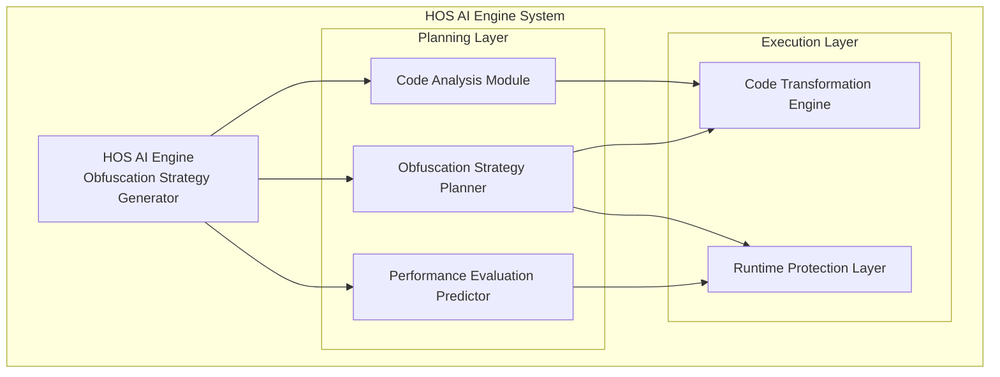

# HOS-MAKE v0.5.0 - AI-Driven Code Encryption System

HOS-MAKE (Honestly Of Selfish) is an AI-driven personalized code encryption system designed to "selfishly" protect developers' code. It supports multiple programming languages and provides comprehensive code obfuscation and runtime protection.

## Core Features

- **AI-Dynamic Obfuscation Strategy**: Each user has unique "genes"
- **Intelligent Performance and Security Balance**: Automatically adjusts obfuscation strength
- **Powerful Runtime Protection**: Prevents debugging and memory tampering
- **Multi-language Support**: Supports Python, C/C++, Rust, Go, ARM assembly, and WebAssembly
- **Modular Design**: Easy to extend and customize
- **AI API Integration**: Support for OpenAI, Anthropic Claude, Google Gemini, and local fallback
- **Advanced Encryption**: AES-256 for string encryption with dynamic keys
- **Polymorphic Obfuscation**: Advanced data obfuscation techniques
- **Performance Optimization**: Caching and efficient algorithms for large codebases

## v0.5.0 Features - Python Code Protection

### Data Obfuscation
- **Constant Splitting**: Splits large constants into multiple smaller values
- **Dynamic Calculation**: Replaces static values with dynamic expressions
- **Encoding Table**: Adds custom encoding tables for data transformation
- **Polymorphic Encoding**: Generates unique encoding schemes for each obfuscation
- **String Encryption**: AES-256 encryption for string literals with dynamic keys

### Control Flow Obfuscation
- **Control Flow Flattening**: Transforms linear code into state machine-based execution
- **Fake Branches**: Adds dummy conditional branches to confuse static analysis
- **Exception-Driven Flow**: Uses exceptions for control flow to bypass analysis tools
- **Loop Transformations**: Converts for loops to while loops with complex conditions
- **Random State Mapping**: Uses random state values and jump tables for control flow

### Instruction-Level Transformations
- **Garbage Instruction Injection**: Adds useless instructions to increase code complexity
- **Instruction Substitution**: Replaces instructions with semantically equivalent variants
- **Register Allocation Obfuscation**: Renames variables to obscure their purpose

### Virtualization Transformations
- **Bytecode Virtualization**: Converts code to custom bytecode interpreted at runtime
- **Interpreted Execution**: Runs code through a custom interpreter

### AI-Driven Features
- **Personalized Obfuscation Strategies**: Unique protection for each user
- **Intelligent Strength Adjustment**: Balances security and performance
- **Context-Aware Analysis**: Analyzes code structure to optimize obfuscation

### Command-Line Interface
- **File and Directory Protection**: Supports both single files and entire directories
- **Multiple Strength Levels**: Low, Medium, High
- **Performance Modes**: Performance, Balanced, Security
- **AI Provider Selection**: Local, OpenAI, Anthropic, Google

### Runtime Protection
- **Anti-debugging**: Detects and prevents debugging attempts
- **Memory Tampering Protection**: Prevents runtime memory modifications

### Testing and Reliability
- **Comprehensive Test Suite**: 31 tests covering all features
- **Edge Case Handling**: Supports complex Python syntax and constructs
- **Cross-Platform Compatibility**: Works on Windows, macOS, and Linux

## System Architecture



## Quick Start

### Installation

```bash
# Using Poetry
poetry install

# Or using pip
pip install .
```

### Basic Usage

```bash
# Encrypt Python file
hos-make protect --input example.py --output protected_example.py

# Encrypt entire directory
hos-make protect --input src/ --output protected_src/

# Custom obfuscation strength
hos-make protect --input example.py --output protected_example.py --level high

# Use specific AI provider
hos-make protect --input example.py --output protected_example.py --provider openai --api-key YOUR_API_KEY

# Different performance modes
hos-make protect --input example.py --output protected_example.py --mode performance  # Fast but less secure
hos-make protect --input example.py --output protected_example.py --mode balanced     # Balance of security and performance
hos-make protect --input example.py --output protected_example.py --mode security     # Maximum security
```

## Directory Structure

```
hos/
├── analyzer/        # Code analysis module
├── ai/              # AI obfuscation strategy generation
├── transformer/     # Code transformation engine
├── runtime/         # Runtime protection layer
├── performance/     # Performance evaluation predictor
├── cli/             # Command line tools
└── utils/           # Utility functions
tests/               # Test files
docs/                # Documentation
examples/            # Example code
```

## Technology Stack

- **Core Language**: Python 3.8+
- **Code Analysis**: Tree-sitter
- **AI Model**: Fine-tuned model based on Code LLM
- **Build Tool**: Poetry
- **Testing Framework**: pytest
- **Encryption**: cryptography (AES-256)
- **AI Providers**: OpenAI, Anthropic Claude, Google Gemini (optional)

## Development Guide

### Running Tests

```bash
poetry run pytest
```

### Code Style Checking

```bash
poetry run black hos/ tests/
poetry run isort hos/ tests/
poetry run flake8 hos/ tests/
```

## API Documentation

### Programmatic Use

HOS-MAKE can be used programmatically in your Python scripts:

```python
from hos import analyze, transform
from hos.ai import AIStrategyGenerator

# Analyze code
code = "def hello(): return 'Hello, World!'"
analysis = analyze(code)

# Generate obfuscation strategy
ai_generator = AIStrategyGenerator(provider='local')
strategy = ai_generator.generate_strategy(analysis, mode='balanced')

# Set obfuscation strength
strategy.set_strength(0.7)  # 0.0 (weak) to 1.0 (strong)

# Transform code
transformed_code = transform(code, strategy)
print(transformed_code)
```

### Strategy Configuration

You can manually configure the obfuscation strategy:

```python
from hos.ai import ObfuscationStrategy

# Create a custom strategy
strategy = ObfuscationStrategy()

# Configure data obfuscation
strategy.data['constant_splitting'] = True
strategy.data['dynamic_calculation'] = True
strategy.data['string_encryption'] = True

# Configure control flow obfuscation
strategy.control_flow['flattening'] = True
strategy.control_flow['fake_branches'] = True
strategy.control_flow['exception_flow'] = True

# Configure instruction-level obfuscation
strategy.instruction['garbage_injection'] = True
strategy.instruction['instruction_substitution'] = True

# Configure virtualization
strategy.virtualization['enabled'] = True
strategy.virtualization['bytecode_vm'] = True
```

### Batch Processing

```python
import os
from hos import transform_file
from hos.ai import AIStrategyGenerator

# Create strategy generator
ai_generator = AIStrategyGenerator()

# Process multiple files
input_dir = 'src'
output_dir = 'protected_src'

os.makedirs(output_dir, exist_ok=True)

for root, _, files in os.walk(input_dir):
    for file in files:
        if file.endswith('.py'):
            input_path = os.path.join(root, file)
            output_path = os.path.join(output_dir, os.path.relpath(input_path, input_dir))
            
            # Create output directory if needed
            os.makedirs(os.path.dirname(output_path), exist_ok=True)
            
            # Generate strategy for this file
            with open(input_path, 'r') as f:
                code = f.read()
            
            from hos import analyze
            analysis = analyze(code)
            strategy = ai_generator.generate_strategy(analysis, mode='security')
            
            # Transform file
            transform_file(input_path, output_path, strategy)
```


## Contribution

Contributions, issues, and feature requests are welcome!

## License

[MIT License](LICENSE)


